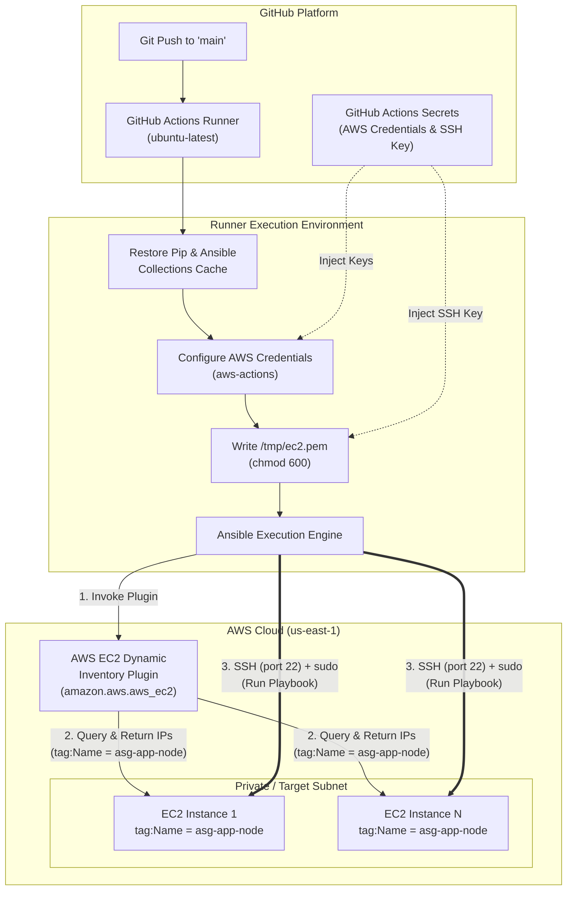

# Automated AWS Configuration Management via GitHub Actions & Ansible

---

## 📄 Project Overview & Purpose

> ### **System Purpose**
> **Core Objective:** An end-to-end automated CI/CD and configuration management pipeline that leverages **GitHub Actions** and **Ansible** to dynamically discover, connect to, and configure AWS EC2 Auto Scaling Group (ASG) nodes. The system utilizes **AWS Dynamic Inventory (`amazon.aws.aws_ec2`)**, multi-layer pipeline caching, and secure ephemeral SSH credential injection to automatically provision application dependencies (**Node.js, npm, Nginx**) upon push to the main branch.

---

## 🏗️ System Architecture & Execution Flow



---

## ⚡ Key Architectural Features

### 1. High-Performance GitHub Actions Caching Strategy
To minimize workflow execution time, the pipeline implements dual-layer dependency caching:
* **Python Environment Caching:** Caches both site-packages (`~/.local/lib/python3.10/site-packages`) and binary executables (`~/.local/bin`) under key `${{ runner.os }}-python-env-v1-ansible-modules`. Bypasses `pip install ansible boto3 botocore` on cache hit.
* **Ansible Galaxy Collection Caching:** Caches installed collections under `~/.ansible/collections` with key `${{ runner.os }}-ansible-galaxy-v1`. Avoids re-downloading the `amazon.aws` collection on repeated workflow runs.

### 2. Dynamic Infrastructure Discovery (`amazon.aws.aws_ec2`)
Instead of maintaining static IP addresses in a static inventory file (which break when Auto Scaling Groups replace or launch instances):
* Uses the `amazon.aws.aws_ec2` inventory plugin.
* Queries AWS APIs in `us-east-1` for active instances matching state `running` and tag `Name: asg-app-node`.
* Automatically groups discovered targets into a dynamic Ansible host group named `tag_Name_asg_app_node`.
* Automatically evaluates `ansible_host` using the public IP address with a fallback to private IP: `"{{ public_ip_address | default(private_ip_address) }}"`.

### 3. Ephemeral & Zero-Trust Secret Management
* AWS Access Keys and SSH Private Keys are stored securely in **GitHub Secrets** and injected strictly runtime-only.
* The SSH key is written to temporary runner storage (`/tmp/ec2.pem`) with restrictive file permissions (`chmod 600`), ensuring secure SSH agent interactions without leaving lingering credentials.

---

## 📁 Repository Directory Structure

```text
.
├── .github/
│   └── workflows/
│       └── deploy.yml                        # GitHub Actions CI/CD Pipeline
└── ansible/
    ├── ansible.cfg                           # Ansible Global Configuration & Plugin Activation
    ├── aws_ec2.yaml                          # AWS EC2 Dynamic Inventory Plugin Spec
    ├── group_vars/
    │   └── tag_Name_asg_app_node.yaml        # Target Group Specific Variables (User, SSH Key)
    └── tag_Name_asg_app_node.yaml            # Main Deployment Playbook (Nginx, Node.js, npm)
```

---

## 🛠️ Configuration & Source Code Reference

### 1. GitHub Actions Pipeline (`.github/workflows/deploy.yml`)

```yaml
name: CI-CD Pipeline

on:
  push:
    branches:
      - main

jobs:
  run-ansible:
    runs-on: ubuntu-latest

    defaults:
      run:
        working-directory: ansible

    steps:
      - name: Checkout Repository Code
        uses: actions/checkout@v4

      - name: Set up Python
        uses: actions/setup-python@v5
        with:
          python-version: '3.10'

      # Cache Pip packages and binary execution directory
      - name: Cache Installed Python Packages
        id: cache-pip-env
        uses: actions/cache@v4
        with:
          path: |
            ~/.local/lib/python3.10/site-packages
            ~/.local/bin
          key: ${{ runner.os }}-python-env-v1-ansible-modules

      - name: Install Ansible & AWS modules via pip
        if: steps.cache-pip-env.outputs.cache-hit != 'true'
        run: |
          pip install --user ansible boto3 botocore

      # Cache Ansible Galaxy Collections
      - name: Cache Ansible Galaxy Collections
        id: cache-galaxy
        uses: actions/cache@v4
        with:
          path: ~/.ansible/collections
          key: ${{ runner.os }}-ansible-galaxy-v1

      - name: Install Ansible AWS Collection
        if: steps.cache-galaxy.outputs.cache-hit != 'true'
        run: |
          ansible-galaxy collection install amazon.aws:==6.5.0 --force

      - name: Configure AWS Credentials
        uses: aws-actions/configure-aws-credentials@v4
        with:
          aws-access-key-id: ${{ secrets.AWS_ACCESS_KEY_ID }}
          aws-secret-access-key: ${{ secrets.AWS_SECRET_ACCESS_KEY }}
          aws-region: us-east-1

      # Add local bin path so cached ansible binaries are executable
      - name: Add Local Bin to Path
        run: echo "$HOME/.local/bin" >> $GITHUB_PATH

      - name: Set up SSH Key File
        run: |
          echo "${{ secrets.EC2_SSH_KEY }}" > /tmp/ec2.pem
          chmod 600 /tmp/ec2.pem

      - name: Run Ansible Playbook
        run: |
          ansible-playbook tag_Name_asg_app_node.yaml
```

---

### 2. Ansible Global Settings (`ansible/ansible.cfg`)

```ini
[defaults]
inventory = aws_ec2.yaml
host_key_checking = False
interpreter_python = auto_silent

[inventory]
enable_plugins = amazon.aws.aws_ec2, host_list, script, yaml, ini
```

---

### 3. AWS Dynamic Inventory Spec (`ansible/aws_ec2.yaml`)

```yaml
plugin: amazon.aws.aws_ec2
regions:
  - us-east-1

# Automatically create groups based on tag values
keyed_groups:
  - key: tags.Name
    prefix: tag_Name
    separator: "_"

compose:
  ansible_host: "{{ public_ip_address | default(private_ip_address) }}"

filters:
  instance-state-name: [running]
  tag:Name: ["asg-app-node"]
```

---

### 4. Group Variables (`ansible/group_vars/tag_Name_asg_app_node.yaml`)

```yaml
ansible_user: ubuntu
ansible_ssh_private_key_file: /tmp/ec2.pem
```

---

### 5. Deployment Playbook (`ansible/tag_Name_asg_app_node.yaml`)

```yaml
---
- name: Configure Backend Servers and Install Nginx
  hosts: tag_Name_asg_app_node
  become: true  # Execute tasks with root privileges (sudo)
  force_handlers: yes

  tasks:
    - name: Update apt cache (apt-get update)
      apt:
        update_cache: yes
        cache_valid_time: 3600

    - name: Install Node.js, npm and nginx
      apt:
        name: ["nodejs", "npm", "nginx"]
        state: present

    - name: Print the nodejs and npm version
      shell: node -v && npm -v
      register: version_output

    - name: Print the version output to terminal
      debug:
        var: version_output
```